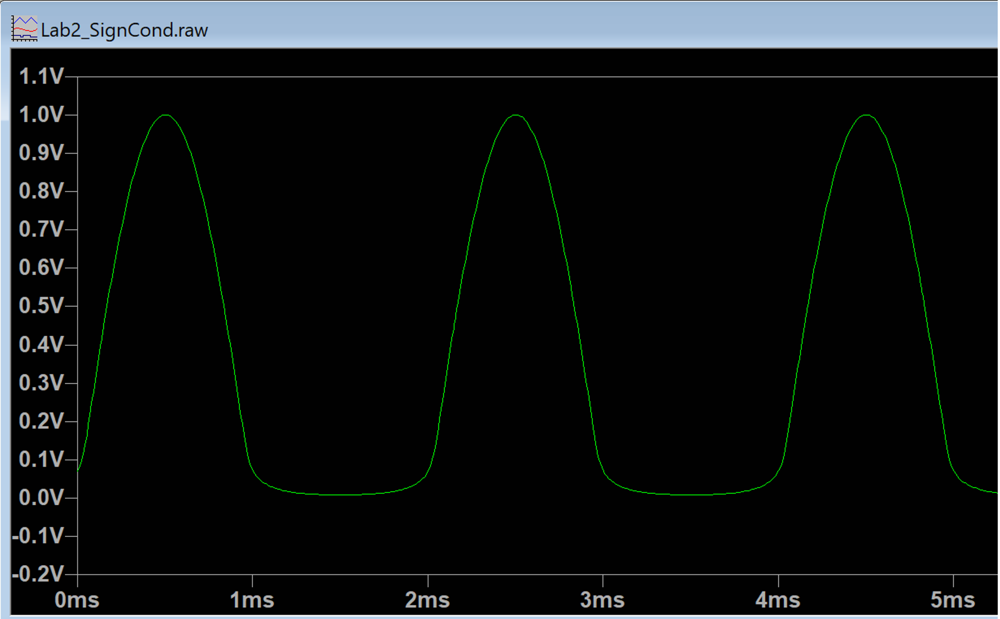

# Answer Sheet - Lab 2

## Part 1: Differential Amplifiers

Q 1.1: Analyse the OpAmp circuit in the figure above using your theoretical knowledge and sketch the theoretically expected output voltage waveform (Vop(out)). Simulate this circuit on LTspice using the model provided (labelled Part 1A) and verify your theoretically obtained results. Note that the LM324.lib has to be in the same folder as the LTspice simulation file, as we call this  LM324 OpAmp model from within LTspice.

> Transfer function of Vop(out) : Sin(1000 * pi * t)

> Replace **_Lab2_Images/1Q1Theory.png_** with your theoretical sketch

> Replace **_Lab2_Images/1Q1Sim.png_** with your simulated waveform

Q 1.2: Why is your theory and simulation showing that the output is distorted/clipped (i.e., the output is not an exactly amplified AC waveform)?  

> The output is a clipped sine wave since the opamp can not output a voltage greater or lower than the voltages supplied to the rails, and since the bottom rail is 0V the output can not go below 0V.

Q 1.3: Based on the LM324 datasheet provided on Canvas, what is the maximum output voltage an LM324 can produce when it is supplied by a single-rail 5V source? In the datasheet this is usually referred to as the “High-level output voltage” or VOH. This would change with operating temperature and the current supplied through the output pin of the OpAmp (i.e. the load supplied by the OpAmp). Assume 25 degrees C and a 2kOhm load. Can the simulation model mimic this behaviour? To check this, increase the amplitude of the signal labelled Vsens (in the simulation model provided this is set by the AC source V3 found in the section labelled Power/Signal sources) to 0.5V. See if the high-level output voltage of the OpAmp circuit clips close to the level indicated in the datasheet.

> From datasheet VOH when OpAmp supplied by 5V: 3.5V

> VOH observed in simulation: 3.5V

Q 1.4: Based on the plot provided above, what is the minimum output voltage an LM324 can produce when it is supplied by a single-rail 5V source? Assume that the LM324 has to sink 1mA.

> Minimum VOL from plot: 0.7V

Q 1.5: Analyse the OpAmp circuit in the figure above using your theoretical knowledge and sketch the theoretically expected output voltage waveform (Vop(out)). Simulate this circuit on LTspice using the model provided (labelled Part 1B) and verify your theoretically obtained results.

> Transfer function of Vop(out) : 2.1 + sin(1000 * pi * t)

> Replace **_Lab2_Images/1Q5Theory.png_** with your theoretical sketch

> Replace **_Lab2_Images/1Q5Sim.png_** with your simulated waveform

## Part 2: Conditioning Current Measurement

Q 2.1: Determine the resistor values R1 and R2 required to produce an output voltage signal (Vio) that has an offset of 2.1V and a peak-peak voltage of 2V when the AC load current is a maximum. Make sure to select resistors from the E12 series. The value of the shunt resistor (Rs) should be what you determined in Q3.4 of Lab 1. Note that you have already calculated and validated the minimum and maximum values of IL as well as Vis in Lab 1. So, refer to lab 1 to extract this information.

> R1: 4.2K (2.7 + 1.5)

> R2: 10K

Q 2.2: Modify the simulation model provided (sections of the model labelled ‘Part 2’ and ‘AC Source, Load and Sensors’) to verify that you have calculated the correct resistor values in Q2.1. As you did in Lab 1, you can validate the design by changing load resistance/supply voltage to vary the VA drawn by the AC load, while keeping it within 7.5VA to 2.5VA and observing the sensed voltage (Vis) as well as the output voltage (Vio).

> Summarise key findings (theoretical vs simulated) in the table below. Here we are analysing the circuit under 3 possible scenarios, including the two extreme cases (i.e. minimum and maximum load current). We are assuming that L is exactly 4mH and RL is changed to simulate varying load conditions. You should extract the values you have calculated in Lab 1 (Q3.2) to complete part of this table.

| Source VA  | Vac(rms) | RL       | IL       | Vis,pk Theo | Vis,pk Sim  | Vio,pk Theo | Vio,pk Sim  |
| -----------|----------|----------|----------|-------------|-------------|-------------|-------------|
| 7.5VA      | 12.6V    | 16.53    | 0.595    | 0.421       | 0.421       | 3.10        | 3.10        |
| 7.5VA      | 15.4V    | 28.52    | 0.490    | 0.344       | 0.344       | 2.92        | 2.92        |
| 2.5VA      | 15.4V    | 93.53    | 0.163    | 0.115       | 0.115       | 2.37        | 2.37        |

> Comments (state if OpAmp output may clip or not): output will not clip since the shift is large enough to increase teh minimum value past 0V but not shift the maximum value higher than 3.5 volts

Q 2.3: What will happen if the corresponding resistor pairs of the differential amplifier are not equal to each other (e.g. R1 in each arm differ slightly from each other)?

> If the values for R1 are different in each branch then the 2.1 voltage shift will not be preserved, since the branches need to have the same values to preserve the shift. The other effect is that the amplification factor will change since the ratios between the resistors will change.

Q 2.4: What could you do to improve the accuracy of current measurement under light loads? Under light load IL reach the minimum current load current you determined during Lab 1. Since the differential amplifier gain is fixed, Vio can be quite small.

> By adding an amplifier with a gain of 1.6 or less to the end of our circuit (Vio) we can amplify our signal while ensuring that the max output of 3.1 will not be increased past the 5 volt limit of our adc. (3.1 * 1.6 = 4.96)

## Part 3: Conditioning Voltage Measurement

Q 3.1: Determine the resistor values R1a, R1b, and R2 required to produce an output voltage signal that has an offset of 2.1V and a peak-peak voltage of about 2Vpk-pk when the AC source voltage is a maximum. Make sure to select resistor values from the E12 series. The values of the voltage divider resistors (Ra and Rb) are what you determined in Q4.3 of Lab 1. Note that you have already calculated and validated the minimum and maximum values of Vvs in Lab 1. So, refer to Lab 1 to extract this information.

> R1a: 1k

> R1b: 1.39k

> R2: 1.39k

Q 3.2: Modify the simulation model provided (sections of the model labelled ‘Part 3’ and ‘AC Source, Load and Sensors’) to verify that you have calculated the correct resistor values in Q3.1. As you did in Lab 1, you can validate the design by changing supply voltage (within the specified range) and observing the sensed voltage (Vvs) as well as the output voltage (Vvo).

> Summarise key findings (theoretical vs simulated) in the table below. Here we are analysing the circuit under 3 possible scenarios including the two extreme cases (i.e. minimum and maximum AC voltage). We are assuming that L is exactly 4mH and RL is changed to simulate varying load conditions. You should extract the values you have calculated in Lab 1 (Q4.2) to complete part of this table.

| Source VA  | Vac(rms) | RL       | IL       | Vvo,pk Theo | Vvo,pk Sim  |
| -----------|----------|----------|----------|-------------|-------------|
| 7.5VA      | 12.6V    |   16.53  |  0.595   |  2.91       |  2.19       |
| 7.5VA      | 15.4V    |   28.52  |  0.490   |  3.10       |  3.09       |
| 2.5VA      | 15.4V    |   93.53  |  0.163   |  3.10       |  3.09       |

> Comments (state if OpAmp output may clip or not): output will not clip since the shift is large enough to increase teh minimum value past 0V but not shift the maximum value higher than 3.5 volts

Q 3.3: State why Vvs has an offset (i.e. it is not a pure AC waveform) once you connect the voltage divider with the differential amplifier?

> Because the first branch of the amplifier has 2.1V source which is higher than Vvs at all times, the voltage of Vvs is increased.

Q 3.4: When selecting the resistors for your differential amplifier circuits, would you pick them to be in the Ohms, Kilo-Ohms, or Mega-Ohms range? State issues relating to using resistor values that are too small (Ohms) or too large (Mega-Ohms).

> Reasons not to use very small resistor values (e.g. Ohms): Smaller resistors will allow more current to flow and increase the power dissipation.

> Reasons not to use very large feedback resistor values (e.g. Mega-Ohms): Using larger resistors would waste money on expensive resistors and introduce more noise.

Q 3.5: Assume that LM324 OpAmps become unavailable (products get discontinued very often in real life) and you had to order a different OpAmp. What device parameters would you need to consider? Is there a minimum and/or maximum rating for each of these parameters that need to be observed? Complete the following table – we have given you an example.

| Parameter                     | Max and/or Min Specification    |
| ------------------------------|---------------------------------|
| Single rail supply voltage    | Min rating < 5V < Max rating    |
| Operating Temp                | 0 to 70 deg C                   |
| Slew Rate                     | 0.5                             |
| Noise Voltage                 | < 35v @ 1kH                     |
| Input offset voltage          | 7V                              |
| Total supply voltage          | 3 - 32 Volts                    |

## Part 4: Filters

Q 4.1: Derive the transfer function (Vfilter/VOpAmp) of the RC filter shown above to show that it functions as a 1st order low-pass filter. Determine the values of Cf and Rf required to ensure a -3dB cut-off frequency of 10kHz. Note that, the AC sources is expected to generate a significantly strong noise components at frequencies 100kHz and beyond. As such, it is a good decision to place the filter cut-off frequency at 10kHz, which is significantly lower than noise frequency but still considerably higher than the 500Hz signal frequency.

> Transfer function Vfilter/VOpAmp: 1 / (1 + S * Rc)

> Cf and Rf: 10nF and 10k ohms

Q 4.2: Sketch the theoretically expected output voltage waveform (Vfilter) of the RC filter if the input is a 2Vpk-pk AC signal that has an offset of 2.1V. Modify the simulation model provided by editing Cf and Rf values as per Q4.1 (section of the model labelled ‘Part 4’) and verify your theoretically obtained results.

> Replace **_Lab2_Images/4Q2Theory.png_** with your theoretical sketch

> Replace **_Lab2_Images/4Q2Sim.png_** with your simulated waveform

Q 4.3: Sketch the theoretically expected bode magnitude and phase plots of the filter transfer function (Vfilter/VOpAmp). Using AC analysis option provided in LTspice, simulate the frequency response of the RC filter circuit (section of the provided model labelled ‘Part 4’) and verify your theoretically obtained results. To assist, the simulation command required is provided in the comments under ‘Simulation Commands’.

> Replace **_Lab2_Images/4Q3Theory.png_** with your theoretical sketch

> Replace **_Lab2_Images/4Q2Sim.png_** with your simulated waveform

Q 4.4: What will be the impact of shifting the filter cut-off frequency closer to 500Hz or 100kHz? Validate your answer using LTspice.

> A cut-off frequency closer to 500Hz results in: Shifting the area of large phase shift to the left. i.e. the large phase shift will occur with lower frequencies.

> A cut-off frequency closer to 100kHz results in: Large phase shifts occurring over a much higher range of frequencies.

## Part 5: DC Regulator Circuit

Q 5.1: The smoothing capacitor Cs in the regulator circuit above is selected in order to make sure the voltage ripple at the input (dVin) to the regulator is acceptable. Note that the worst case line regulation of the LT1085 regulator IC according to the datasheet is 0.5%. Thus, a certain dVin will result in an output ripple of dVin x 0.5%. If Cs is chosen to be 47uF, stating your assumptions, determine the approximate value of dVin. Simulate the operation of regulator circuit using the LTspice model provided (labelled ‘Part 5’) and verify your answer.

> Assumptions:

> Theoretical dVin:

> Simulated dVin: 8.255

Q 5.2: On LTspice, observe Vac and Ireg waveforms, and sketch them here. State why the current waveform looks like short-duration bursts.

> Replace **_Lab2_Images/5Q2Sim.png_** with your simulated waveform

> Ireg looks like short-duration bursts because: Whenever the ac source oscilliates the diode restricts the current from flowing.

Q 5.4: What are the benefits and disadvantages of using a half-wave rectifier opposed to a full-wave rectifier in your design?

> Advantages of a half-wave rectifier:

> Disadvantages of a half-wave rectifier:

Q 5.5: How can you derive the 2.1V offset required for the differential amplifiers from the 5V DC supply that you just designed? Sketch a suitable circuit, simulate and verify the answer. Hint: Using just a simple voltage divider is not the best solution. You need extra circuitry in addition to the voltage divider to derive a stable and clean 2.1V signal.

> Replace **_Lab2_Images/5Q4Circuit.png_** with your circuit diagram

