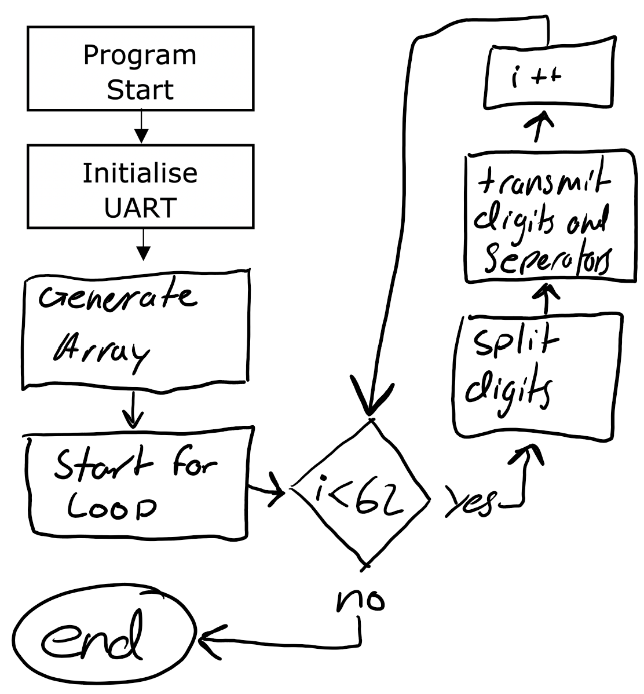

# Answer Sheet - Lab 3

## Pre-Lab: Using Atmel Studio

Q P.1: What was the largest number stored in the array, in decimal and in hex?

> 293, 01 25

Q P.2: Why did the memory window show a lot of 00 elements between some of the numbers in the array?

> each element in the array is stored as a 16 bit integer, which requires 4 hex digits to store. since most of the numbers only use two hex digits, the other two will be insignificant.

## Part 1: What is UART?

Q 1.1: What is the purpose of each of the following parameters and bits?

> The start bit: the transmission drops from the usual high value to a low value for one clock cycle to tell the device to start reading data.

> The parity bit: the parity bit counts the number of 1 values in the frame and is 0 if there are an even amount and 1 if there are an odd amount.

> The number of stop bits: two stop bits can be used to sacrifice speed for extra processing time when the baud rate is high.

> The baud rate: the baud rate is the transfer speed measured in bits per second.

## Part 2: How do we control the microcontroller?

Q 2.1: Using the datasheet, state the register and bits that control each of the settings below, and describe the purpose of each of these settings. Identify whether or not we need this setting, and if we do, determine if the setting is set at initialisation or if it is used at runtime:

| Setting Name              | Register & Bits        | Purpose                    | Needed?  | Innit or Runtime  |
| --------------------------|------------------------|----------------------------|----------|-------------------|
| Receive Complete          | UCSR0A RXC0(Bit 7)     | USART Rx complete flag     | No       | Runtime           |
| Data (Tx) Register Empty  | UCSR0A UDRE0(Bit 5)    | USART ready to Tx flag     | Yes      | Runtime           |
| Tx Complete               | USCR0A TXC0(Bit 6)     | Transmit Shift Reg empty   | No       | Runtime           |
| Mode Selection            | UCSR0C UMSEL0(Bit 6&7) | USART Operation Mode       | No       | Innit           |
| Character Size            | UCSR0B UCSZ02(Bit 2) & USCR0C UCSZ00&01 (Bit 1&2) | Number of bits per frame   | Yes     | Innit            |
| Clock Polarity            | UCSR0C UCPOL0(Bit 0)   | Sync Edge Polarity         | No       |  Innit        |
| Baud Rate                 | UBRR0H(Bit 0-3) & UBRR0L | Set the Baud rate. 4 most sig digits in H and other 8 digits in L | Yes      |  Innit           |
| Receiver Enable           | UCSR0B  RXEN0(Bit 4)   | Enable the USART receiver  | No       | Runtime           |
| Transmitter Enable        | UCSR0B  TXENn(Bit 3)   | Enable the USART transmitter | Yes      |  Runtime            |
| Parity Mode               | UCSR0C UPMn(Bit 4&5)   | Enable Parity and set odd or even | No     |  Innit         |
| Parity Error              | UCSR0A UPE0(Bit 2)     | Set if parity error detected | No     | Runtime         |

Q 2.2: Using the datasheet, what is the appropriate UBRR value, assuming that our system clock is 2MHz?

> 12

Q 2.3: On the ATMega328P, the UBRR is divided up between two registers, UBRR0H and UBRR0L. Why do you think this is the case?

> Since they have to store a 12 bit number they have to divide it between two registers.

Q 2.4: Using your answers from Q 2.1 and the datasheet, for each of the three control registers below, fill out the table with the short name for each bit, and the value we need to set it to during initialisation. Your options are 0 or 1 – if you don’t care what the value is, set it to 0.

> UCSR0A

| RXC0   | TXC0   | UDRE0  |  FE0   | DOR0   | UPE0   | U2X0   | MPCM0  |
|:------:|:------:|:------:|:------:|:------:|:------:|:------:|:------:|
| 0      | 0      | 0      | 0      | 0      | 0      | 0      | 0      |

> UCSR0B

| RXCIE0 | TXCIE0 | UDRIE0 | RXEN0  | TXEN0  | UCSZ02 | RXB80  | TXB80  |
|:------:|:------:|:------:|:------:|:------:|:------:|:------:|:------:|
| 0      | 1      | 0      | 0      | 1      | 0      | 0      | 0      |

> UCSR0C

| UMSEL01| UMSEL00| UMP01  | UMP00  | USBS0  | UCSZ01 | UCSZ00 | UCPOL0 |
|:------:|:------:|:------:|:------:|:------:|:------:|:------:|:------:|
| 0      | 0      | 0      | 0      | 0      | 1      | 1      | 0      |

Q 2.5: For each of these instructions, finish the C macro expression:

> Test if the UDRE0 bit is 1:

```c
if( UCSR0A & (1 << UDRE0 )) {
   //Code...
}
```

> Write a 1 (set) to the TXEN0 bit:

```c
UCSR0B |= ( 1 << TXEN0 );
```

> Write a 0 (clear) to the UCPOL0 bit:

```c
UCSR0C &= ~(1 << UCPOL0);
```

## Part 3: What data are we sending?

Q 3.1: On the ATMega328P, how many bits of data can be stored in a variable of each of these types:

> char: 8 bits

> uint8_t: 8 bits

> int: 32 bits

> uint16_t: 16 bits

> int8_t: 8 bits

> float: 32 bits

Q 3.2: What is the size of the UDR0 register?

> 8 bits

Q 3.3: What is the largest number we can transmit?

> 255

Q 3.4: What numbers would correspond to the word “HELLO”?

> 72 69 76 76 79

Q 3.5: Fill in the blanks below to describe how to send a number to a terminal:

> We can extract the individual digits of a number by using the __modulo__ operator. Then we encode an individual digit into its ASCII equivalent by simply adding the number __48__. Then we iterate through each digit of the number using a __loop__, writing each character to the __data__ register.


## Part 4: It’s time to transmit data!  

Q 4.1: Assuming that we can begin transmitting a UART packet immediately after the previous one ends, work out the length of time required to send each of these:

> A single character: 8 bits of data plus a stop and a start bit make a 10 bit frame. sent at a baud rate of 9600 means the time is 10 / 9600 = 1.04 ms

> A 3-digit number: a 3 digit number will require three frames, taking 1.04 * 3 = 3.12ms

Q 4.2: Now, also assuming that we need to send a comma character and a space character between each number, work out the length of time to send each of these:

> Three 3-digit numbers: three three digit numbers would require 9 frames and then an additional 4 frames to send two commas and two spaces, making 13 frames. 13 * 1.04 = 13.5ms

> The entire primes list from pre-lab (assume all 3-digits): 62 three digit numbers plus 61 comma seperators make (62 * 3) + (61 * 2) = 308 frames. 308 * 1.04 = 320.8ms

Q 4.3: Write a **_usart_init(uint16_t ubrr)_** function which sets up the USART peripheral as determined in Part 2. Of the five control registers, how many could be left with their initial values?

> since we only need to set USCR0B and one of the baud rate registers, three out of the 5 can be left as defualt.

Q 4.4: Write a **_usart_transmit(uint8_t data)_** function which handles transmission of a single number through the USART peripheral. The important steps are to:

> Step 1: Check bit __5__ of register __USCR0A__ and wait if __it's set to 1__

> Step 2: Load __the data__ into the __transmit data buffer__ register

Q 4.7: Modify your program so that it follows these steps:

> Step 1: Call **_usart_init(ubrr)_** using the UBRR value calculated in Q2.2

> Step 2: Put the list of primes from the pre-lab into memory (in an array)

> Step 3: Inside the while(1) loop, set up a __for loop__
>
> a.	Extract the individual characters of your prime numbers
>
> b.	Call usart_transmit(character) as needed
>
> c.	Call usart_transmit(character) for the comma and space as needed
>
> d.	Increment __the array index__

Q 4.8: Complete the flowchart below that describes the flow of your program code:

> Replace **_Lab3_Images/flowchart.png_** with image of your flowchart (adjust width as needed)



## Optional Task: Advanced String Processing

Q O.2) Compile both the sprintf and the original version of your code. Now, compare the size of the generated “.hex” (a better measure of the code size than the “elf”.

> Which is larger?

> By how many times is it larger?
