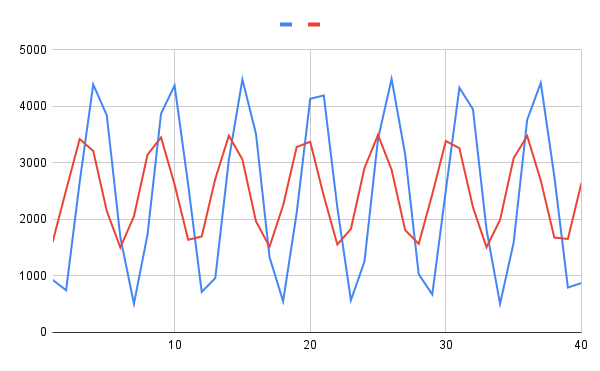

# Answer Sheet - Lab 4

## Pre-Lab: Digital I/O

Q P.1: What is the purpose of a DDRn register?

> A Data Direction Register configures the pins in a port to be input pins or output pins

Q P.2: Which pin is the LED connected to?  

> Pin 5 of port B

Q P.3: How much of a delay is there between the ATmega328P producing a logic high (5V) output to drive the LED from the time the push-button is pressed generating a logic low (0V) input (Hint: Change the time scale)? Why is this?

> 9 Microseconds

## Part 1: What is an ADC?

Q 1.1: Based on the lecture slides, datasheet, COMPSYS201 coursebook, and other online resources, write a description for each of these terms in your own words:

> Channel Selection: Selecting which pin from the ADC port will be used as the input

> Sample and Hold: Sample and Hold allows the adc to sample the changing analog value from the input at one point in time, and then hold that value long enough to convert it to a digital value. Without this the adc would have to deal with a constantly changing input as it tries to convert it to a digital format.

> Successive Approximation: A successive Approximation circuit calculates the adc output by preforming a binary search to match the analog input. A SAR guesses the value and then adjusts this guess depending of whether it is higher or lower than the analog input. It continues to adjust the "guess" until it reaches an appropriate approximation

> Reference Voltage: ADC circuits need a reference voltage to provide context to the analog reading. since the adc can only output values within a certain range, it needs to know what analog inputs correspond to the top of this range and what inputs correspond to the bottom of this range.

> Sampling Rate: the sampling rate is the number of outputs that the adc can preform each second. this is dependent on the sample and hold capacitor and the delay in the adc circuitry.

> Resolution: Since an ADC is trying to represent a continuous range of analog values with a discrete range of binary numbers, the adc must condense all the possible analog values into (typically) 256 digital values. this means that each adc digital output can only be accurate within a limited resolution, the range of analog voltages that get condensed into a single digital number

Q 1.2: How many input channels are connected to the ADC on the ATMega328P?

> 8 adc channels and one temperature sensor

Q 1.3: How many channels can this ADC process simultaneously?

> only one channel can be measured at once, but after the conversion is complete we can switch the adc input channel to any other channel.

Q 1.4: How many clock cycles does a standard ADC conversion take? How long is this in real-world time if we have a 125kHz ADC clock?

> a standard conversion takes 13 ADC clock cycles. (1/125000) * 13 * 1000 = 0.104 ms

Q 1.5: Which stage of the sampling process requires the most time? Why?

> the most time consuming part of the sampling process is the conversion logic, due to the multiple steps required by the successive approximation.

Q 1.6: Write a formula that gives the ADC count you expect to obtain when converting an analogue signal that has an amplitude of Vanalog. Assume Vref of your ATmega328P/PB is set to 5V and Vanalog<5V.

> ADC Output = (Vanalog * 1024) / Vref

Q 1.7: Based on the project specifications and the characteristics of the ATMega328P ADC, what is the voltage resolution (i.e. how many volts does one ADC count correspond to)?

> 5 / 2^10 * 1000 = 4.8828 MilliVolts

Q 1.8: What is the recommended operating frequency range for the ADC if we want to read 10-bit numbers?

> 50kHz to 200kHz

Q 1.9: In this lab you will supply a 125kHz to the ADC on the ATmega328P/PB. What is the prescaler value needed to achieve this ADC frequency?

> 2,000,000 / x = 125000    prescaler = 16

## Part 2: Controlling the ADC

Q 2.1: What are our options for setting the reference voltage on this ADC, and which one is most fit-for-purpose for your project?

> We can either use the internal voltage reference of 1.1v, AVcc of 5V, or a custom refrence voltage through AREF. the best choice for this project is using the 5V AVcc since the max voltage of the signal we are reading is about 3 volts.

Q 2.2: For each of the control registers below, fill out the table with the short name for each bit, and the value we need to set it to during initialisation. Your options are 0 or 1 – if you don’t care what the value is, set it to 0.

> ADMUX

| REFS1  |        |        |        |        |        |        |        |
|:------:|:------:|:------:|:------:|:------:|:------:|:------:|:------:|
|   0    |   1    |   0    |   0    |   0    |   0    |    0   |    0   |

> ADCSRA

|        |        |        |        |        |        |        |        |
|:------:|:------:|:------:|:------:|:------:|:------:|:------:|:------:|
|   0    |   0    |   0    |   0    |   0    |   1    |   0    |    0   |

> ADCSRB

|        |        |        |        |        |        |        |        |
|:------:|:------:|:------:|:------:|:------:|:------:|:------:|:------:|
|   0    |   0    |   0    |   0    |   0    |   0    |   0    |   0    |

Q 2.3: Create a new Atmel Studio project and using your answers thus far, write a function called adc_init(), which initializes the ADC component. Provide the completed skeleton code below.

> adc.c

```c
#include "adc.h"
#include <avr/io.h> //necessary for definitions of ADMUX etc
void adc_init() {
    //TODO: initialisation code goes here
}
```

## Part 3: Reading from the ADC

Q 3.1: Write C code to change ADMUX to read from ADC1, without affecting the other bits in ADMUX that do not control channel selection:

```c
ADMUX &= ~((1<<MUX3) | (1<<MUX2) | (1<<MUX1));
ADMUX |= (1<<MUX0);
```

Q 3.2: Which bit do we set to start an ADC conversion?

> ADSC

Q 3.3: Which bit do we check to know if the conversion is complete?

> ADSC

Q 3.4: When we read the ADC result, we use ADCL and ADCH. Why are there two data registers for storing the ADC result?

> Because the output from the ADC is a 10 bit number it needs more than one 8 bit register to store it.

## Part 4: Processing the Data

Q 4.1: Using your answers thus far, add a function called **_adc_convert(value)_** to your program, which takes a raw ADC count and converts it back to the original voltage value. Write out the pseudocode steps (like the ones shown in Q 3.5) here:

```c
double adc_convert_mv(uint16_t value){
	double result = (value * 5) / 1024;
	return result;
}
```

Q 4.2: What do you observe in the simulation when

> RV1 is set to 100%, what does the ADC read?
> 1023
> RV1 is set to 50%, what does the ADC read?
> 512
> RV1 is set to 0%, what does the ADC read?
> 0

Q 4.5: Run your compiled code using the Lab4_Proteus.pdsprj which has two 500Hz sine wave inputs on ADC0 and ADC1 (remember to change the device back to an ATmega328P ). The signal on ADC0 has an amplitude of 2V and an offset of 2.5V. The signal on ADC1, which is delayed with respect to the signal on ADC0 by a 300 phase-lag, has an amplitude of 1V and an offset of 2.5V. Observe the printed voltages on Proteus’s virtual terminal. Plot these waveforms on Excel to verify the functionality of your code.

> Replace **_Lab4_Images/plot.png_** with image of your plot (adjust width as needed)



## Part 5: Calculating Power

Q 5.1: Let us assume that both the voltage and current are sinusoidal signals with the same time period. If the ADC is supplied with a 125kHz clock, how much of a time-delay would there be between two consecutive ADC0 and ADC1 samples?

> Add answer here

## Optional Task: Implementing Power Calculation

Q O.1: Modify your C program to implement your chosen method for calculating power, and print the results through to the terminal. Compare these results to your theoretical result obtained in Q5.2 – how much difference is there? Where does this difference come from?

> Add answer here

Q O.2: Note that the design specifications limit the rate at which you can take ADC readings to a maximum of 10kHz (i.e., ADC conversion rate). This means we can’t take as many ADC readings as we would like to. In the code you have developed so far, you are using a 125kHz ADC clock and operating it in the single conversion mode. At what rate are currently taking ADC readings? How can you verify that you are taking an ADC reading at this theoretical rate you calculated? How would you increase the rate at which you take ADC samples?

> Add answer here

Q O.3: What could be an advantage of operating the microcontroller at a lower clock frequency and taking fever ADC samples?

> Add answer here

Q O.4: In Q4.4 why did we first store the ADC values in to two arrays and only sent them over UART once all 100 samples were collected? Can we not send the ADC values over UART as we read them from the ADC?

> Add answer here
